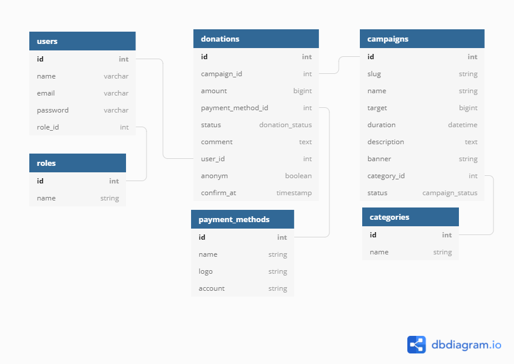

# Final Project

## Kelompok 17

## Anggota Kelompok

* Anggota 1 : Aughy Vikri Jamuri (aughyvikrii@gmail.com)
* Anggota 2 : David Basa Halomoan (davidhutabarat47@gmail.com)
* Anggota 3 : Muhammad Esa Yusriana (mesayusriana12@gmail.com)

## Pembagian Tugas

* Aughy Vikri Jamuri
1. Template Publik
2. Template User
3. Modul User (Dashboard, Riwayat Donasi, Detail Donasi)
4. Update Profile User
5. Hosting

* David Basa Halomoan
1. RUD Manajamen User
2. CRUD Metode Pembayaran

* Muhammad Esa Yusriana
1. Autentikasi (Login & Register)
2. CRUD Campaign
3. CRUD Kategori Campaign
4. Transaksi Penerimaan Donasi
5. Templating Admin
6. Sebagian Landing Page

## Tema Project

Tema : Fundraising

Deskripsi : Aplikasi yang dibuat dinamakan "Jabar Bangkit Bersama", merupakan sebuah aplikasi yang berfungsi dalam mengumpulkan donasi untuk membantu masyarakat yang berada di Jawa Barat.

## Demo
Link Aplikasi: [https://jbb.permata.dedv](https://jbb.permata.dev)

Video ERD: [https://www.youtube.com/watch?v=dvlt1qU8w6k](https://www.youtube.com/watch?v=dvlt1qU8w6k)

Video Aplikasi: [https://www.youtube.com/watch?v=VmqR9ZFee7o](https://www.youtube.com/watch?v=VmqR9ZFee7o)

Admin: admin@jbb.id : adminjbb

## Gambar ERD (Entity Relational Database)

## Library 

* [Laravel Sweetalert](https://github.com/realrashid/sweet-alert)
* [DataTables](https://github.com/DataTables/DataTables)
* [CKEditor4](https://github.com/ckeditor/ckeditor4)
* [Bootstrap Datepicker](https://github.com/uxsolutions/bootstrap-datepicker)
* [CropperJS](https://github.com/fengyuanchen/cropperjs)
